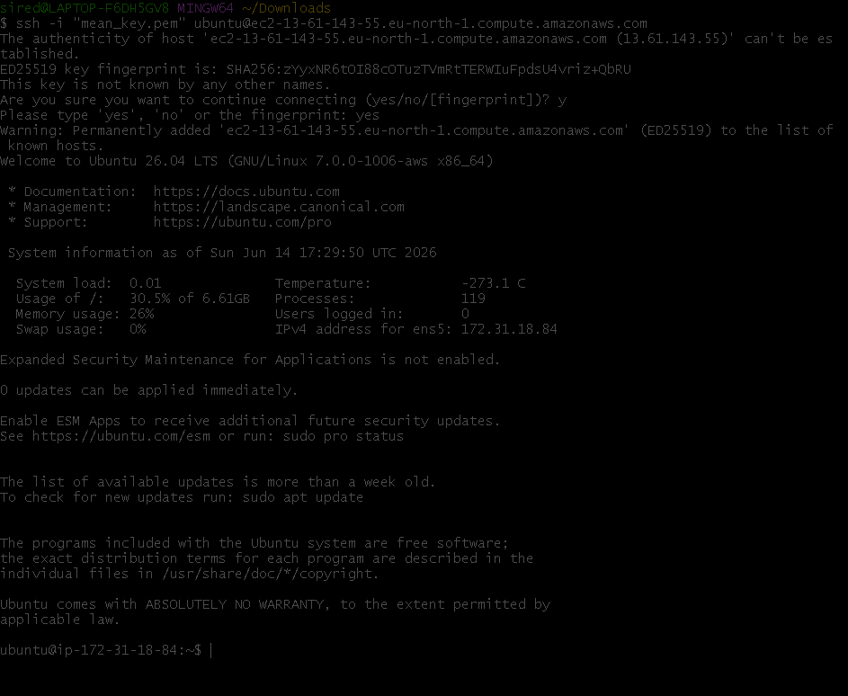
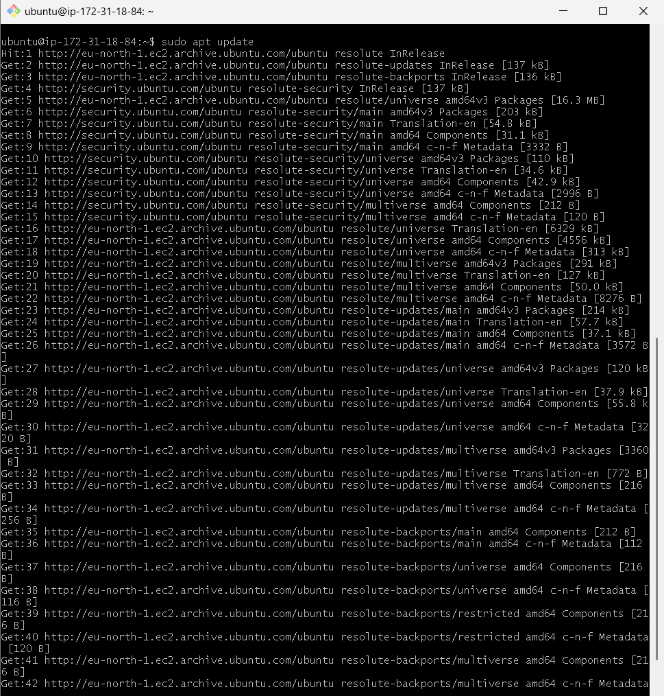
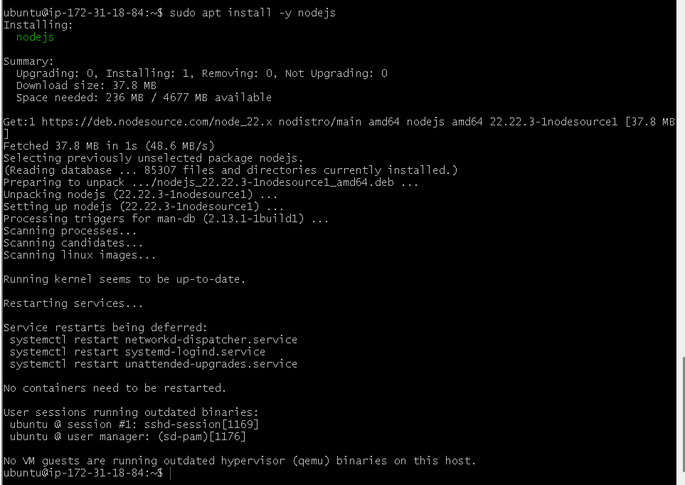
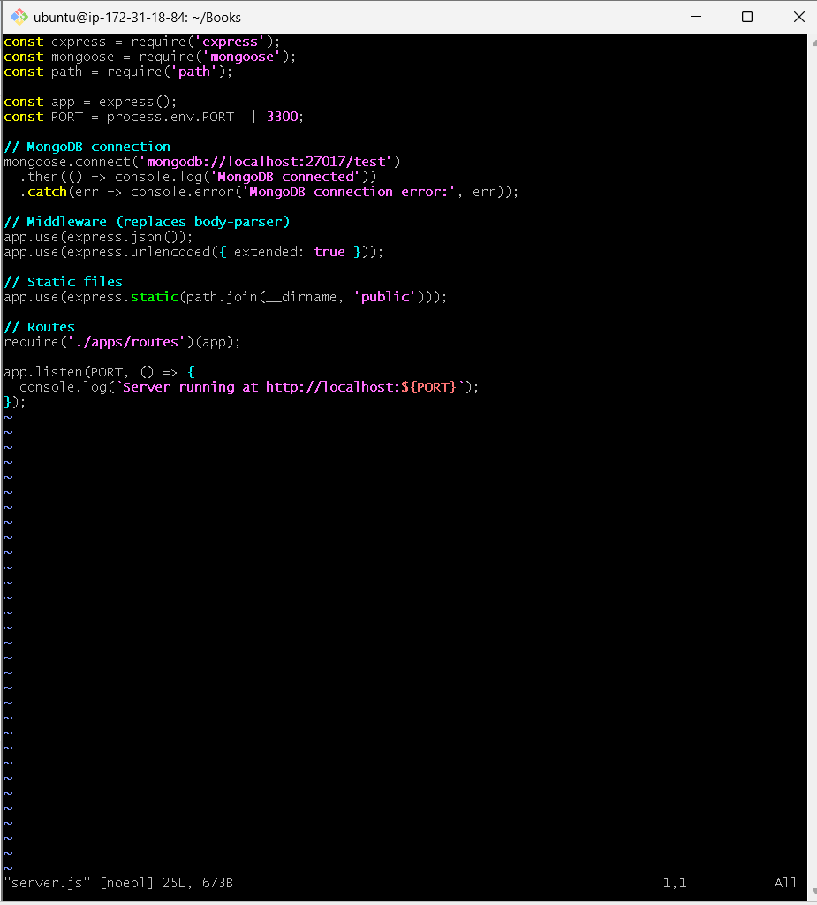
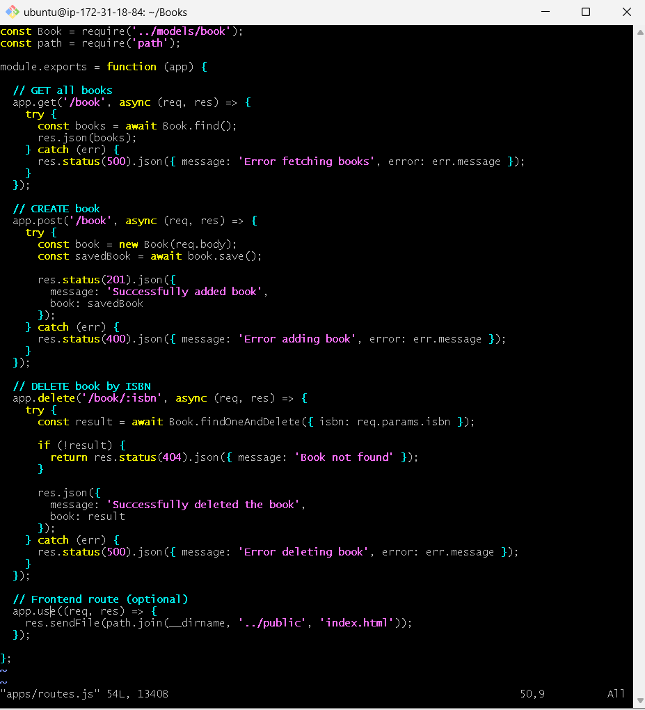
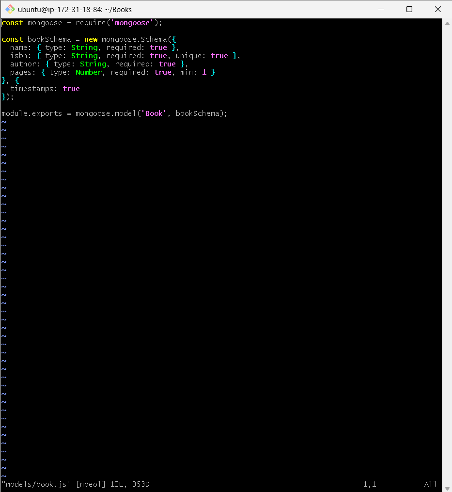
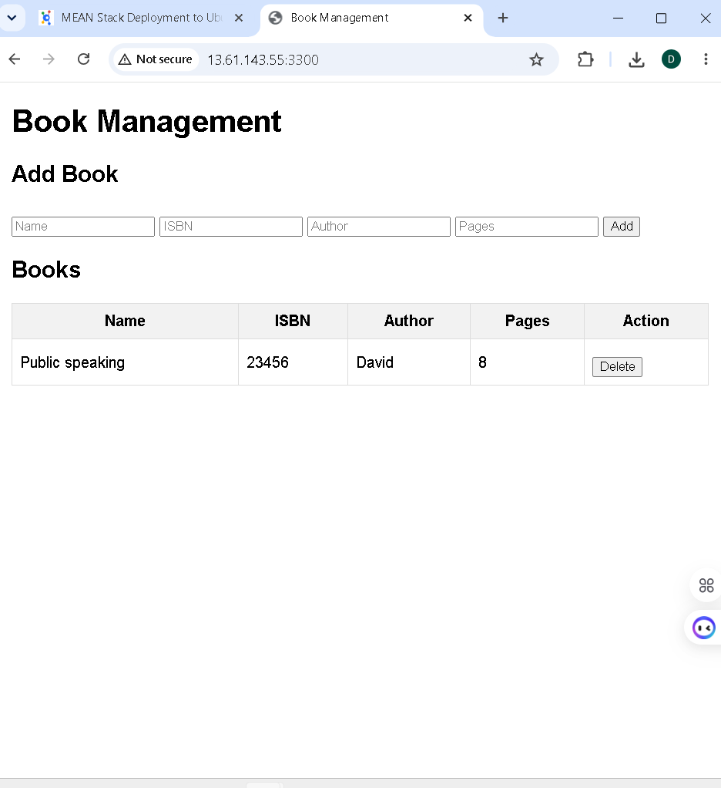

# WEB STACK IMPLEMENTATION (MEAN STACK) ON AWS

## Introduction

This document describes the deployment of a MEAN stack application on AWS using an Ubuntu EC2 instance.
It covers the backend setup with Node.js, Express, MongoDB, and the frontend setup using AngularJS.

The MEAN stack is a combination of following components:

- **MongoDB** – Document database that stores and allows to retrieve data.
- **Express** – Back-end application framework that makes requests to Database for Reads and Writes.
- **Angular** – Front-end application framework that handles Client and Server Requests.
- **Node.js** – JavaScript runtime environment that accepts requests and displays results to end user.

## Architecture Overview

| Component | Technology | Role |
| --- | --- | --- |
| Database | MongoDB | Data persistence for books and application data |
| Backend | Node.js + Express | API server and business logic |
| Frontend | AngularJS | Browser-based UI |
| Deployment | AWS EC2 | Cloud hosting for the full stack |

---

## Prerequisites

- AWS account with an EC2 instance launched (Ubuntu 24.04 or similar)
- SSH key pair for the EC2 instance
- EC2 security group inbound rules open for:
  - `22` (SSH)
  - `80` (HTTP)
  - `3300` (Node.js server)
- MongoDB installed and running on the instance
- Node.js and npm installed

## Side Self Study

Before proceeding, refresh your knowledge on the following topics:

- Refresh your knowledge of OSI model
- Read about Load Balancing, get yourself familiar with different types and techniques of traffic load balancing
- Practice in editing simple web forms with HTML + CSS + JS

## Prerequisite Steps

1. Create or sign into your AWS account.
2. Open the EC2 console and launch a new Ubuntu instance.
   - Choose Ubuntu 24.04 LTS or another supported Ubuntu version.
   - Select a general-purpose instance type such as `t2.micro` for development.
3. Create or select an SSH key pair.
   - Download the private key file (`.pem`) and store it securely.
4. Create a new security group or update an existing one.
   - Add inbound rule for port `22` to allow SSH from your IP.
   - Add inbound rule for port `80` to allow HTTP traffic.
   - Add inbound rule for port `3300` to allow the Node.js server to receive requests.
5. Attach the security group to your EC2 instance.
6. Confirm that your EC2 instance has a public IP address.

---

## Step 0 – Preparing Prerequisites

In order to complete this project you will need an AWS account and a virtual server with Ubuntu Server OS.

If you do not have an AWS account – go back to create a new EC2 Instance of t2.micro family with Ubuntu Server 24.04 LTS (HVM) image. Remember, you can have multiple EC2 instances, but make sure you STOP the ones you are not working with at the moment to save available free hours.

Hint: In previous projects we used different tools to connect to an EC2 instance, but if you do not want to install or launch anything outside of AWS, you can open your CLI straight from Web Console in AWS.

---

## SSH into the EC2 Instance

Connect to the EC2 instance using your PEM key.

```bash
chmod 400 my-key.pem
ssh -i "my-key.pem" ubuntu@<EC2_PUBLIC_DNS>
```



Once connected, update the instance packages:

```bash
sudo apt update && sudo apt upgrade -y
```



---

## Step 1: Install NodeJS

Node.js is a JavaScript runtime built on Chrome's V8 JavaScript engine. Node.js is used in this tutorial to set up the Express routes and AngularJS controllers.

### Add NodeSource Repository

Add the NodeSource repository to install the latest LTS version of Node.js:

```bash
curl -fsSL https://deb.nodesource.com/setup_lts.x | sudo -E bash -
```

### Install Node.js and npm

Install Node.js (which includes npm):

```bash
sudo apt install -y nodejs
```




### Update npm to Latest Version

Update npm to the latest version:

```bash
sudo npm install -g npm
```

### Verify Installation

Verify Node.js and npm are installed correctly:

```bash
node -v
npm -v
```


---

## Step 2: Install MongoDB

MongoDB stores data in flexible, JSON-like documents. Fields in a database can vary from document to document and data structure can be changed over time. For our example application, we are adding book records to MongoDB that contain book name, isbn number, author, and number of pages.

### Add MongoDB Repository

Add the MongoDB official repository GPG key and repository:

```bash
curl -fsSL https://www.mongodb.org/static/pgp/server-7.0.asc | sudo gpg -o /usr/share/keyrings/mongodb-server-7.0.gpg --dearmor
```

### Add MongoDB Repository Source

Add the MongoDB repository to your system (for Ubuntu 24.04 - Noble):

```bash
echo "deb [ arch=amd64,arm64 signed-by=/usr/share/keyrings/mongodb-server-7.0.gpg ] https://repo.mongodb.org/apt/ubuntu noble/mongodb-org/7.0 multiverse" | sudo tee /etc/apt/sources.list.d/mongodb-org-7.0.list
```

### Update Package List

```bash
sudo apt update
```

### Install MongoDB

```bash
sudo apt install -y mongodb-org
```

### Enable and Start MongoDB Service

Enable MongoDB to start on system boot:

```bash
sudo systemctl enable mongod
```

Start the MongoDB service:

```bash
sudo systemctl start mongod
```

### Verify MongoDB is Running

Verify that the MongoDB service is up and running:

```bash
sudo systemctl status mongod
```


### Create a Folder Named 'Books'

```bash
mkdir Books && cd Books
```

### Initialize npm Project

Initialize a new npm project (this will create package.json):

```bash
npm init -y
```

### Install Express and Mongoose

Install the necessary packages:

```bash
npm install express mongoose
```

### Add a File Named server.js

```bash
vi server.js
```

#### How to Use Vi Editor

Once you type `vi server.js`, the editor opens with the file. Follow these steps:

1. **Enter Insert Mode**: Press `i` to enter insert mode (you'll see `-- INSERT --` at the bottom)
2. **Paste Code**: Right-click and select paste (or use Ctrl+Shift+V) to paste the code below
3. **Save and Exit**:
   - Press `Esc` to exit insert mode
   - Type `:wq` (colon, w, q) and press `Enter`
   - This saves (w) and quits (q) the editor

### Copy and Paste Server Code

Copy and paste the web server code below into the `server.js` file:

```javascript
const express = require('express');
const mongoose = require('mongoose');
const path = require('path');

const app = express();
const PORT = process.env.PORT || 3300;

// Middleware
app.use(express.json());
app.use(express.static(path.join(__dirname, 'public')));

// MongoDB connection
mongoose.connect('mongodb://localhost:27017/bookstore', {
  useNewUrlParser: true,
  useUnifiedTopology: true
})
.then(() => console.log('MongoDB connected'))
.catch(err => console.error('MongoDB connection error:', err));

// Routes
require('./apps/routes')(app);

app.listen(PORT, () => {
  console.log(`Server up: http://localhost:${PORT}`);
});
```



---

## Step 3: Install Express and Set Up Routes to the Server

Express is a minimal and flexible Node.js web application framework that provides features for web and mobile applications. We will use Express to pass book information to and from our MongoDB database.

We also will use Mongoose package which provides a straight-forward, schema-based solution to model your application data. We will use Mongoose to establish a schema for the database to store data of our book register.

**Note:** Express and Mongoose packages were already installed in the previous setup steps above.

### Create Application Folder Structure

In the 'Books' folder, create a folder named 'apps':

```bash
mkdir apps && cd apps
```

### Create Routes File

Create a file named `routes.js`:

```bash
vi routes.js
```

#### How to Use Vi Editor

Once you type `vi routes.js`, the editor opens with the file. Follow these steps:

1. **Enter Insert Mode**: Press `i` to enter insert mode (you'll see `-- INSERT --` at the bottom)
2. **Paste Code**: Right-click and select paste (or use Ctrl+Shift+V) to paste the code below
3. **Save and Exit**:
   - Press `Esc` to exit insert mode
   - Type `:wq` (colon, w, q) and press `Enter`

### Add Routes Configuration

Copy and paste the code below into `routes.js`:

```javascript
const Book = require('./models/book');
const path = require('path');

module.exports = function(app) {
  app.get('/book', async (req, res) => {
    try {
      const books = await Book.find();
      res.json(books);
    } catch (err) {
      res.status(500).json({ message: 'Error fetching books', error: err.message });
    }
  });

  app.post('/book', async (req, res) => {
    try {
      const book = new Book({
        name: req.body.name,
        isbn: req.body.isbn,
        author: req.body.author,
        pages: req.body.pages
      });
      const savedBook = await book.save();
      res.status(201).json({
        message: 'Successfully added book',
        book: savedBook
      });
    } catch (err) {
      res.status(400).json({ message: 'Error adding book', error: err.message });
    }
  });

  app.delete('/book/:isbn', async (req, res) => {
    try {
      const result = await Book.findOneAndDelete({ isbn: req.params.isbn });
      if (!result) {
        return res.status(404).json({ message: 'Book not found' });
      }
      res.json({
        message: 'Successfully deleted the book',
        book: result
      });
    } catch (err) {
      res.status(500).json({ message: 'Error deleting book', error: err.message });
    }
  });

  app.get('*', (req, res) => {
    res.sendFile(path.join(__dirname, '../public', 'index.html'));
  });
};
```



### Create Models Folder

In the 'apps' folder, create a folder named 'models':

```bash
mkdir models && cd models
```

### Create Book Model

Create a file named `book.js`:

```bash
vi book.js
```

#### How to Use Vi Editor

Once you type `vi book.js`, the editor opens with the file. Follow these steps:

1. **Enter Insert Mode**: Press `i` to enter insert mode (you'll see `-- INSERT --` at the bottom)
2. **Paste Code**: Right-click and select paste (or use Ctrl+Shift+V) to paste the code below
3. **Save and Exit**:
   - Press `Esc` to exit insert mode
   - Type `:wq` (colon, w, q) and press `Enter`

### Add Book Schema

Copy and paste the code below into `book.js`:

```javascript
const mongoose = require('mongoose');

const bookSchema = new mongoose.Schema({
  name: { type: String, required: true },
  isbn: { type: String, required: true, unique: true, index: true },
  author: { type: String, required: true },
  pages: { type: Number, required: true, min: 1 }
}, {
  timestamps: true
});

module.exports = mongoose.model('Book', bookSchema);
```



---

## Step 4: Access the Routes with AngularJS

AngularJS provides a web framework for creating dynamic views in your web applications. In this tutorial, we use AngularJS to connect our web page with Express and perform actions on our book register.

### Change Directory and Create Public Folder

Change the directory back to 'Books':

```bash
cd ../..
```

Create a folder named 'public':

```bash
mkdir public && cd public
```

### Create AngularJS Controller Script

Add a file named `script.js`:

```bash
vi script.js
```

#### How to Use Vi Editor

Once you type `vi script.js`, the editor opens with the file. Follow these steps:

1. **Enter Insert Mode**: Press `i` to enter insert mode (you'll see `-- INSERT --` at the bottom)
2. **Paste Code**: Right-click and select paste (or use Ctrl+Shift+V) to paste the code below
3. **Save and Exit**:
   - Press `Esc` to exit insert mode
   - Type `:wq` (colon, w, q) and press `Enter`

Copy and paste the Code below (controller configuration defined) into the `script.js` file:

```javascript
angular.module('myApp', [])
  .controller('myCtrl', function($scope, $http) {
    function fetchBooks() {
      $http.get('/book')
        .then(response => {
          $scope.books = response.data;
        })
        .catch(error => {
          console.error('Error fetching books:', error);
        });
    }

    fetchBooks();

    $scope.del_book = function(book) {
      $http.delete(`/book/${book.isbn}`)
        .then(() => {
          fetchBooks();
        })
        .catch(error => {
          console.error('Error deleting book:', error);
        });
    };

    $scope.add_book = function() {
      const newBook = {
        name: $scope.Name,
        isbn: $scope.Isbn,
        author: $scope.Author,
        pages: $scope.Pages
      };

      $http.post('/book', newBook)
        .then(() => {
          fetchBooks();
          // Clear form fields
          $scope.Name = $scope.Isbn = $scope.Author = $scope.Pages = '';
        })
        .catch(error => {
          console.error('Error adding book:', error);
        });
    };
  });
```

### Create the HTML Interface

In 'public' folder, create a file named `index.html`:

```bash
vi index.html
```

#### How to Use Vi Editor

Once you type `vi index.html`, the editor opens with the file. Follow these steps:

1. **Enter Insert Mode**: Press `i` to enter insert mode (you'll see `-- INSERT --` at the bottom)
2. **Paste Code**: Right-click and select paste (or use Ctrl+Shift+V) to paste the code below
3. **Save and Exit**:
   - Press `Esc` to exit insert mode
   - Type `:wq` (colon, w, q) and press `Enter`

Copy and paste the code below into `index.html` file:

```html
<!DOCTYPE html>
<html ng-app="myApp" ng-controller="myCtrl">
<head>
  <meta charset="UTF-8">
  <meta name="viewport" content="width=device-width, initial-scale=1.0">
  <title>Book Management</title>
  <script src="https://ajax.googleapis.com/ajax/libs/angularjs/1.8.2/angular.min.js"></script>
  <script src="script.js"></script>
  <style>
    body { font-family: Arial, sans-serif; margin: 20px; }
    table { border-collapse: collapse; width: 100%; }
    th, td { border: 1px solid #ddd; padding: 8px; text-align: left; }
    th { background-color: #f2f2f2; }
    input[type="text"], input[type="number"] { width: 100%; padding: 5px; }
    button { margin-top: 10px; padding: 5px 10px; }
  </style>
</head>
<body>
  <h1>Book Management</h1>
  
  <h2>Add New Book</h2>
  <form ng-submit="add_book()">
    <table>
      <tr>
        <td>Name:</td>
        <td><input type="text" ng-model="Name" required></td>
      </tr>
      <tr>
        <td>ISBN:</td>
        <td><input type="text" ng-model="Isbn" required></td>
      </tr>
      <tr>
        <td>Author:</td>
        <td><input type="text" ng-model="Author" required></td>
      </tr>
      <tr>
        <td>Pages:</td>
        <td><input type="number" ng-model="Pages" required></td>
      </tr>
    </table>
    <button type="submit">Add Book</button>
  </form>

  <h2>Book List</h2>
  <table>
    <thead>
      <tr>
        <th>Name</th>
        <th>ISBN</th>
        <th>Author</th>
        <th>Pages</th>
        <th>Action</th>
      </tr>
    </thead>
    <tbody>
      <tr ng-repeat="book in books">
        <td>{{book.name}}</td>
        <td>{{book.isbn}}</td>
        <td>{{book.author}}</td>
        <td>{{book.pages}}</td>
        <td><button ng-click="del_book(book)">Delete</button></td>
      </tr>
    </tbody>
  </table>
</body>
</html>
```

### Application Structure

The recommended folder structure for your MEAN application should look like:

```
Books/
├── server.js
├── package.json
├── public/
│   ├── index.html
│   └── script.js
└── apps/
    ├── routes.js
    └── models/
        └── book.js
```

### Starting the Server

Change the directory back up to 'Books':

```bash
cd ..
```

### Start MongoDB Service

Ensure MongoDB is running:

```bash
sudo systemctl start mongod
```

Start the server by running this command:

```bash
node server.js
```

The server is now up and running on port 3300. You can test the server locally from another SSH terminal:

```bash
curl -s http://localhost:3300
```

It shall return an HTML page.

### Configure AWS Security Group

To access the application from the internet, you need to open TCP port 3300 in your AWS Security Group settings:

### Accessing Your Application from the Internet

Now you can access our Book Register web application from the Internet with a browser using Public IP address or Public DNS name.

Quick reminder how to get your server's Public IP and public DNS name:

- Find it in your AWS web console in EC2 details
- Run `curl -s http://169.254.169.254/latest/meta-data/public-ipv4` for Public IP address
- Run `curl -s http://169.254.169.254/latest/meta-data/public-hostname` for Public DNS name

Your Web Book Register Application will look like this in browser:



### Testing Book Operations

Once your application is running, test all the functionality:

- **Add a Book**: Use the form to add book details (Name, ISBN, Author, Pages)
- **View Books**: All books are displayed in a table with their information
- **Delete a Book**: Click the delete button to remove a book by its ISBN

---

## Application Structure

The recommended folder structure for your MEAN application should look like:

```
Books/
├── server.js
├── package.json
├── public/
│   ├── index.html
│   └── script.js
└── apps/
    ├── routes.js
    └── models/
        └── book.js
```

---

## Troubleshooting

- **MongoDB Connection Error**: Ensure MongoDB service is running with `sudo systemctl status mongodb`
- **Port Already in Use**: Change the PORT variable in `server.js` or use a different port
- **Permission Denied**: Ensure you have proper sudo permissions or file ownership
- **AngularJS Not Loading**: Check that the CDN link to AngularJS is accessible in your browser
- **Cannot Connect to Server**: Verify that port 3300 is open in your AWS security group

---

## Conclusion

Congratulations! You have now completed the MEAN Stack deployment on AWS. You have successfully:

- Set up Node.js and npm on an Ubuntu EC2 instance
- Installed and configured MongoDB for data persistence
- Created an Express.js backend with REST API routes for CRUD operations
- Built an AngularJS frontend that interacts with the backend
- Deployed a complete, functional web application on AWS

The MEAN stack application demonstrates:
- **MongoDB** for flexible data persistence
- **Express** for backend API management and routing
- **Angular** for dynamic frontend interactions and user interface
- **Node.js** as the runtime environment for server-side JavaScript execution

This full-stack application provides a solid foundation for building scalable, maintainable web applications on cloud infrastructure. You are now ready to move on to more complex and advanced cloud engineering projects!
