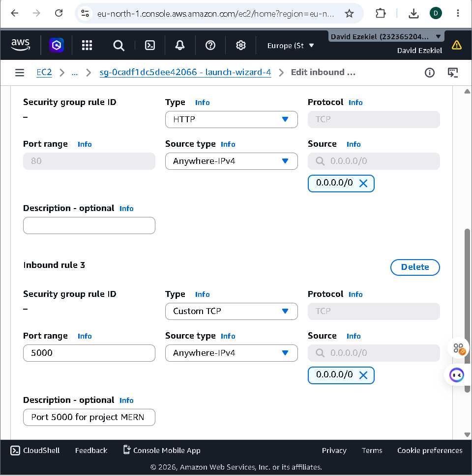
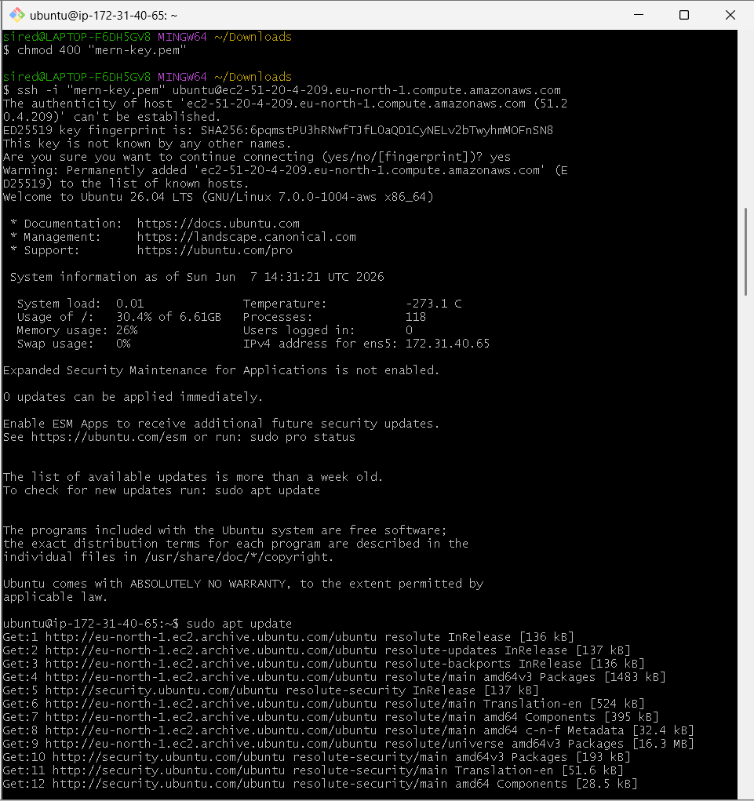
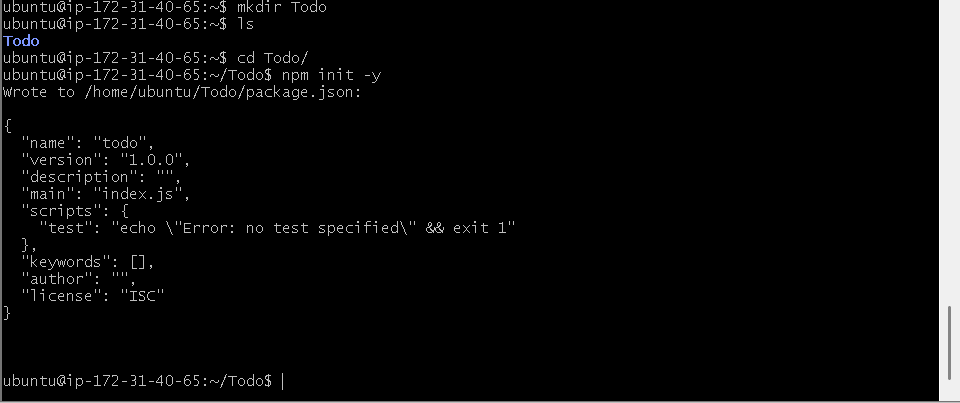
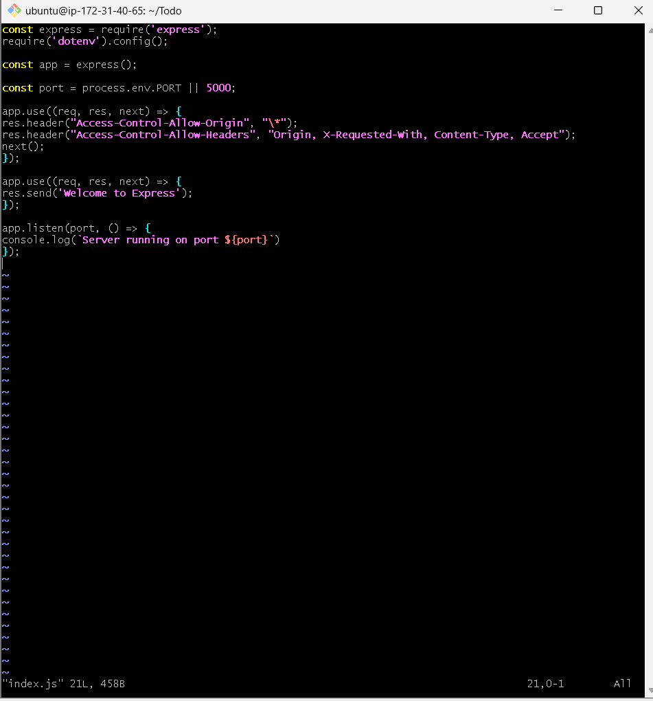
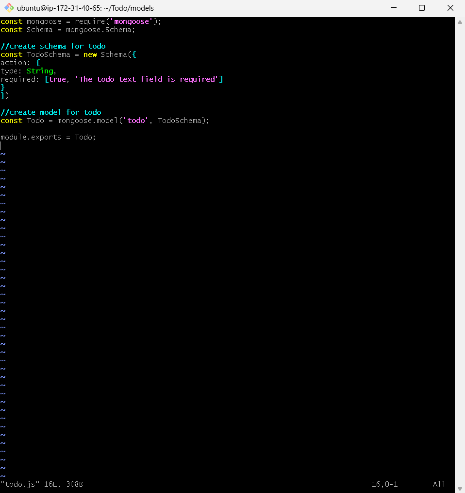
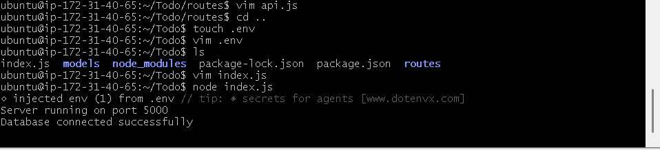
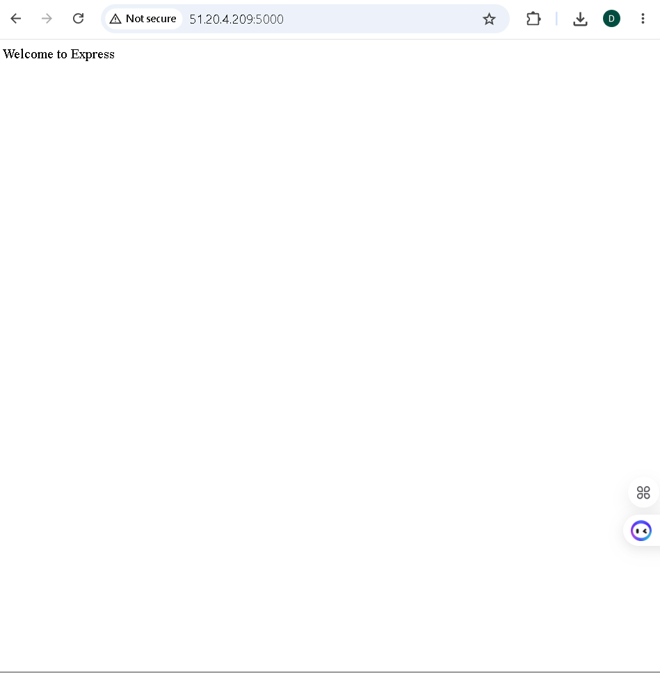
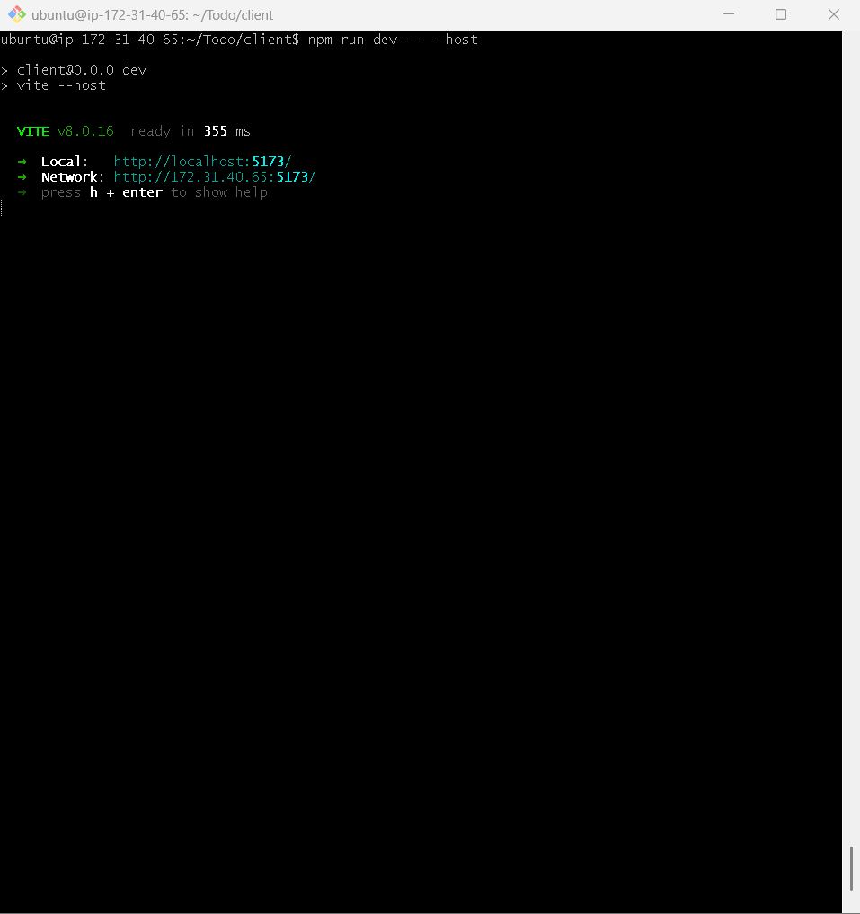
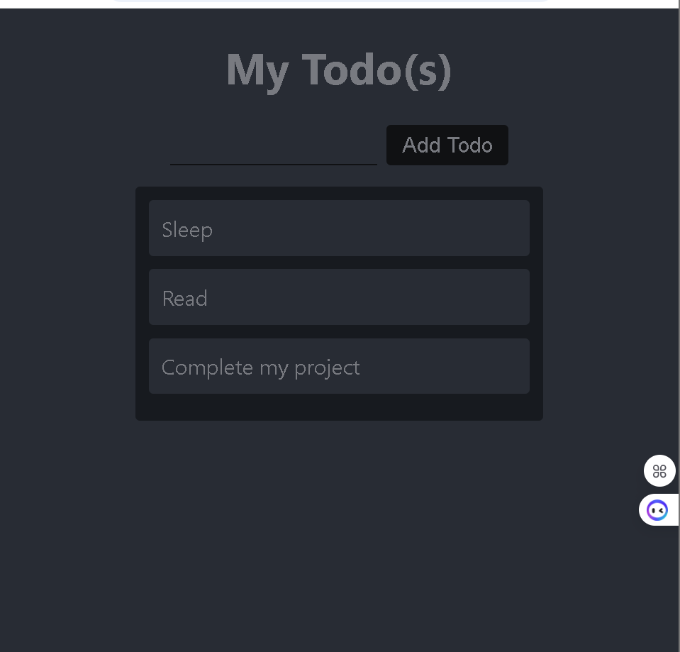

# WEB STACK IMPLEMENTATION (MERN STACK) ON AWS

## Introduction

This document describes the deployment of a MERN stack application on AWS using an Ubuntu EC2 instance.
It covers the backend setup with Node.js, Express, MongoDB, and the frontend setup using a React-based client.

The MERN stack components used in this project are:

- **MongoDB** – NoSQL database for storing application data.
- **Express.js** – Backend web framework for API routing and server logic.
- **React.js** – Frontend user interface library.
- **Node.js** – JavaScript runtime for running the backend server.

## Architecture Overview

| Component | Technology | Role |
| --- | --- | --- |
| Database | MongoDB | Data persistence for tasks |
| Backend | Node.js + Express | API server and business logic |
| Frontend | React / Vite | Browser-based UI |
| Deployment | AWS EC2 | Cloud hosting for the full stack |

---

## Prerequisites

- AWS account with an EC2 instance launched (Ubuntu 24.04 or similar)
- SSH key pair for the EC2 instance
- EC2 security group inbound rules open for:
  - `22` (SSH)
  - `80` (HTTP)
  - `3000` or `5173` (frontend dev server)
  - `5000` (backend API server)
- MongoDB Atlas or MongoDB cluster available for database connectivity

## Prerequisite Steps

1. Create or sign into your AWS account.
2. Open the EC2 console and launch a new Ubuntu instance.
   - Choose Ubuntu 24.04 or another supported Ubuntu version.
   - Select a general-purpose instance type such as `t3.small` for development.
3. Create or select an SSH key pair.
   - Download the private key file (`.pem`) and store it securely.
4. Create a new security group or update an existing one.
   - Add inbound rule for port `22` to allow SSH from your IP.
   - Add inbound rule for port `80` to allow HTTP traffic.
   - Add inbound rule for port `3000` or `5173` if you plan to run the React dev server directly.
   - Add inbound rule for port `5000` to allow the backend API to receive requests.
5. Attach the security group to your EC2 instance.
6. Confirm that your EC2 instance has a public IP address.
7. Prepare MongoDB access.
   - Create a MongoDB Atlas cluster or deploy your own MongoDB instance.
   - Whitelist the EC2 public IP or allow access from the application network.
   - Generate the MongoDB connection string for your `.env` file.

## AWS EC2 and Security Setup

On AWS, configure the EC2 instance and security group so your backend port is accessible.
For this MERN deployment, keep port `5000` open to your public IP or to `0.0.0.0/0` for testing.



## SSH into the EC2 Instance

Connect to the EC2 instance using your PEM key.

```bash
chmod 400 my-key.pem
ssh -i "my-key.pem" ubuntu@<EC2_PUBLIC_DNS>
```

Once connected, update the instance packages:

```bash
sudo apt update && sudo apt upgrade -y
```



## Backend Setup (Node.js + Express)

Create the application folder and initialize the Node.js project:

```bash
mkdir Todo
cd Todo
npm init -y
```



Install backend dependencies:

```bash
npm install express dotenv mongoose body-parser cors
```

Create the backend entry file `index.js` and configure a simple Express server:

```javascript
const express = require('express');
require('dotenv').config();
const app = express();
const port = process.env.PORT || 5000;

app.use((req, res, next) => {
  res.header('Access-Control-Allow-Origin', '*');
  res.header('Access-Control-Allow-Headers', 'Origin, X-Requested-With, Content-Type, Accept');
  next();
});

app.use(express.json());

app.get('/', (req, res) => {
  res.send('Welcome to Express');
});

app.listen(port, () => {
  console.log(`Server running on port ${port}`);
});
```



## Application Structure

Recommended folders and files:

- `index.js`
- `.env`
- `routes/api.js`
- `models/todo.js`
- `client/` (frontend)

### Example MongoDB Todo Model

Create `models/todo.js`:

```javascript
const mongoose = require('mongoose');
const Schema = mongoose.Schema;

const TodoSchema = new Schema({
  action: {
    type: String,
    required: [true, 'The todo text field is required']
  }
});

const Todo = mongoose.model('todo', TodoSchema);
module.exports = Todo;
```



### Example API Routes

In `routes/api.js`, add the basic `GET`, `POST`, and `DELETE` todo routes.
Use Mongoose to persist and retrieve records from MongoDB.

```javascript
const express = require('express');
const router = express.Router();
const Todo = require('../models/todo');

// Get all todos
router.get('/todos', (req, res, next) => {
  Todo.find({}, 'action')
    .then(data => res.json(data))
    .catch(next);
});

// Create a new todo
router.post('/todos', (req, res, next) => {
  if (!req.body.action) {
    return res.status(400).json({ error: 'The input field is empty' });
  }

  Todo.create(req.body)
    .then(data => res.json(data))
    .catch(next);
});

// Delete a todo by ID
router.delete('/todos/:id', (req, res, next) => {
  Todo.findByIdAndDelete(req.params.id)
    .then(data => res.json(data))
    .catch(next);
});

module.exports = router;
```

## Configure MongoDB

Create a `.env` file with your MongoDB connection string:

```text
DB=mongodb+srv://<username>:<password>@<cluster-address>/<dbname>?retryWrites=true&w=majority
PORT=5000
```

Update `index.js` to connect to MongoDB before starting the server:

```javascript
const mongoose = require('mongoose');
const routes = require('./routes/api');

mongoose.connect(process.env.DB)
  .then(() => console.log('Database connected successfully'))
  .catch(err => console.log(err));

mongoose.Promise = global.Promise;

app.use('/api', routes);
```

## Run the Backend

Start the Node.js backend server:

```bash
node index.js
```

You should see the server start and confirm the database connection.



### Verify the API

Open a browser or use Postman to check the root route:

```text
http://<EC2_PUBLIC_IP>:5000
```

You should see the Express welcome response.



## Frontend Setup (React / Vite)

Create the frontend client in the `client` folder.
This setup uses a modern React environment powered by Vite.

```bash
cd Todo
npm create vite@latest client -- --template react
cd client
npm install
```

If you are using a different React scaffolding method, adjust accordingly.

## Run the Frontend

From the `client` directory, start the development server:

```bash
npm run dev -- --host
```

This exposes the frontend on both `localhost` and the network IP.



## Todo Application Screenshot

Below is the rendered Todo list application, showing the interface after deployment and verification.



## Final Notes

- Ensure AWS security group rules allow access to both backend and frontend ports.
- Use `dotenv` securely and never commit `.env` to source control.
- For production, consider using a reverse proxy such as NGINX and enable HTTPS.

## Summary

This document captures the key steps for deploying a MERN stack application on AWS EC2:

- EC2 setup and SSH access
- System updates and Node.js backend configuration
- MongoDB connection using `.env`
- API route structure and MongoDB model creation
- React frontend setup with Vite
- Running and validating both backend and frontend services

With this configuration, your MERN application can be tested locally and served from the cloud while maintaining a clean deployment workflow.
